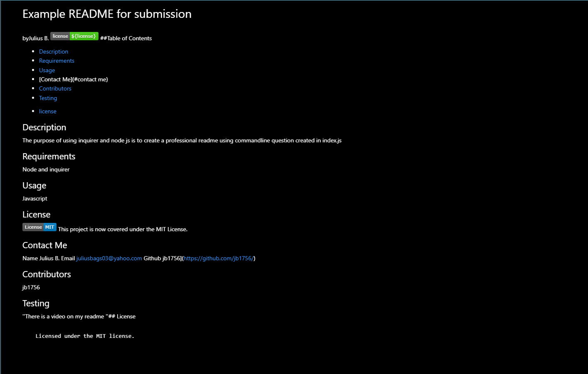

# Professional README
byJulius B

##Table of Contents
- [Description](#description)
- [Requirements](#requirements)
- [Usage](#usage)
- [Contact Me](#contact me)
- [Contributors](#contributors)
- [Testing](#testing)

* [license](#license)

## Description
The purpose of this is to create a professional README using inquirer from npm. 

## Requirements
Node.js and npm i inquirer

## Usage
javascript and screenrecorder

## License 

This project is now covered under the MIT License. 

## Contact Me
  Name Julius B
  Email juliusbags04@yahoo.com
  Github jb1756](https://github.com/jb1756/)

## Contributors
jb1756 and wr

## Testing
''Will upload it.
''## License

## Screenshot 

## Video Link
https://drive.google.com/file/d/19ZuqDrqbK6vHxymnAg7CJiObsG1CJScN/view
  README EXAMPLE IS IN THE DEVELOP FOLDER
    
      Licensed under the MIT license.
